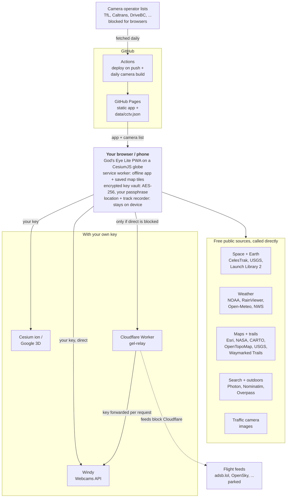
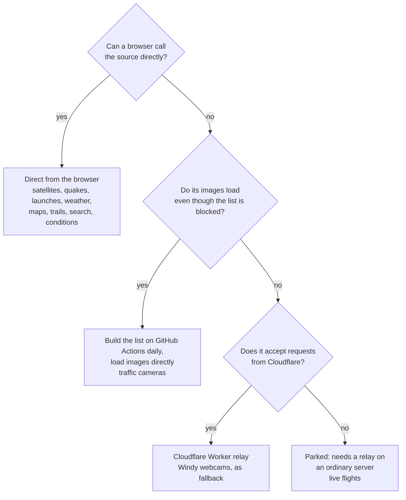
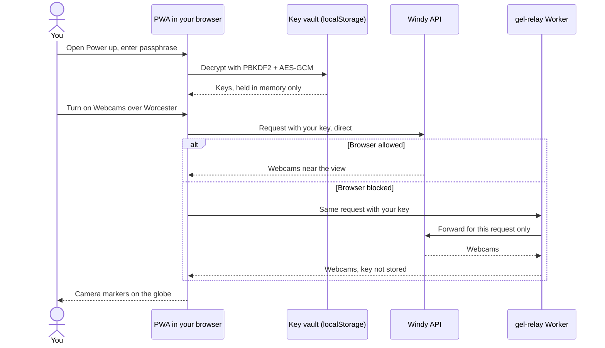

# God's Eye Lite

**▶ Live app: [cptnope.github.io/gods-eye-lite](https://cptnope.github.io/gods-eye-lite/)** · installable on phone and desktop (browser menu → *Install* / *Add to Home Screen*)

A static, installable PWA that puts free, public data on a CesiumJS 3D globe: satellites, earthquakes, launches, weather, ~2,400 traffic cameras, hiking trails and outdoor tools. Inspired by the keyless feeds in [God's Eye View](https://github.com/bilawalsidhu/gods-eye-view). It runs on GitHub Pages with no app server and no required keys; an optional Cloudflare Worker relay handles the few sources browsers can't reach directly.

## How it works

Everything runs in your browser. GitHub Pages serves the app's static files plus one pre-built camera list; the browser then talks to each public data source directly. Two exceptions: camera **lists** are fetched at build time on GitHub's servers (browsers are blocked from them, but the camera **images** load fine), and a small Cloudflare Worker relays services that refuse browser requests.

### How each source is reached

Every feed was tested from a real browser before being wired in. Where it landed:

| Route | Used for | Why |
|---|---|---|
| **Direct from browser** | Satellites, earthquakes, launches, radar, clouds, lightning, wind, cyclones, NWS alerts, conditions, basemaps, trails, outdoor points, search | Source allows cross-site requests |
| **Built on GitHub Actions** | Traffic camera list (`data/cctv.json`) | Operators block browsers from their lists, but their still images embed fine |
| **Cloudflare Worker relay** | Windy webcams (fallback only) | Tried direct first; the Worker forwards your key for that one request |
| **Your own key** | Photorealistic 3D (Cesium ion or Google), Windy webcams | Provider requires a key; stored encrypted on your device |
| **Parked** | Live and military flights | Every free flight feed refuses both browsers and Cloudflare |

### Keys and the relay, step by step

## What's in it

| Layer | Source | Key |
|---|---|---|
| 🛰️ Satellites (SGP4 in-browser, orbit path on click) | CelesTrak TLEs + satellite.js | none |
| 🌍 Earthquakes, last 24h | USGS | none |
| 🚀 Upcoming launches + countdown list | Launch Library 2 (The Space Devs) | none |
| 📷 ~2,400 public traffic cameras with live stills: London, California, Finland, British Columbia, Tallinn, Austin, Sydney, Calgary | Catalog built daily on GitHub Actions with God's Eye View's MIT CCTV loaders; images load straight from each operator | none |
| 📹 Public webcams near your view (scenic, weather, town cams) | Windy Webcams API with **your own free key** (⚡ Power up) | free key |
| 🔎 Address & place search with suggestions, plus 📍 your device location | Photon (komoot) type-ahead, Nominatim on Enter, both OpenStreetMap; browser Geolocation API | none |
| 🥾 Hiking & MTB trail overlays, terrain shading | Waymarked Trails, Esri World Hillshade | none |
| 🗺️ Topo basemaps | OpenTopoMap (worldwide), USGS National Map (US) | none |
| 📍 Peaks, trailheads, water, springs, shelters, campsites, viewpoints, toilets, waterfalls, named hiking routes (click for details, elevation profile & GPX via Waymarked Trails) | OpenStreetMap via Overpass API, loaded for the area in view | none |
| 🌤️ Trail conditions: now, feels-like, gusts, 12 h rain chance, UV, daylight left, thunderstorm / wind / cold warnings, elevation | Open-Meteo | none |
| ⏺ GPS track recorder (distance, time, elevation gain) with GPX export; 📋 my coordinates (decimal + DMS, copy/share); 💾 save the current area offline | Browser Geolocation, Wake Lock, Cache Storage — all on-device | none |
| 🌧️ Rain radar with 3-hour playback | RainViewer (global) or NOAA nowCOAST (US high-res) | none |
| ☁️ Satellite clouds (IR) + ⚡ lightning density | NOAA nowCOAST | none |
| 🌬️ Animated 10 m wind | Open-Meteo | none |
| 🌀 Tropical cyclone cones, tracks, positions | NOAA NHC / CPHC | none |
| ⚠️ Active warnings & advisories (US) | NWS api.weather.gov | none |
| 🗺️ Basemaps: Esri satellite, NASA GIBS "yesterday", CARTO streets/dark | Esri / NASA / CARTO | none |
| 🏙️ Google Photorealistic 3D + world terrain | Cesium ion, or Google Map Tiles API direct | your key (optional) |
| ✈️ Live and 🎖️ military flights | adsb.lol / airplanes.live / adsb.fi / OpenSky | **parked**, see below |

Plus: CRT / NVG / FLIR / Noir sensor shaders (keys `1`–`5`), click-to-inspect cards, follow-cam for satellites, share links that restore camera, layers and sensor, an offline app shell, and a tile cache so revisited areas load offline. Press `/` to search.

## Repository layout

| Path | What it is |
|---|---|
| `index.html` | Page shell and the Content-Security-Policy allowlist |
| `js/app.js` | Globe, layer registry, panel, selection cards |
| `js/layers/` | One module per data layer (satellites, weather, cameras, webcams, ...) |
| `js/outdoor.js`, `js/tiles.js` | Outdoor points, conditions, track recorder, offline areas; shared tile definitions |
| `js/search.js` | Place search and device location |
| `js/vault.js`, `js/keys.js` | Encrypted key vault and the Power up dialog |
| `sw.js` | Service worker: offline app, recent tiles, saved areas |
| `scripts/build-cctv.mjs` | Builds `data/cctv.json` on GitHub Actions |
| `relay/worker.js` | Cloudflare Worker relay |
| `.github/workflows/pages.yml` | Deploys on push and rebuilds the camera list daily |

## Deploy your own copy (≈2 minutes)

1. Fork or copy this repo to a public GitHub repo.
2. Repo **Settings → Pages → Build and deployment → Source: GitHub Actions**.
3. The *Deploy to GitHub Pages* workflow runs on every push and daily. Your app lands at `https://<your-user>.github.io/<repo>/`.
4. Open it on your phone → browser menu → **Add to Home Screen / Install**.

Everything uses relative paths, so it works under a project sub-path or a custom domain unchanged. If you host it elsewhere, update `DEFAULT_ORIGINS` in `relay/worker.js` (or `ALLOWED_ORIGINS` in `relay/wrangler.toml`) so the relay answers your site.

## Relay Worker (`relay/worker.js`)

Deployed as `https://gel-relay.jeremy-anderson.workers.dev`. Data routes answer only `https://cptnope.github.io`; `GET /` returns a small status message.

- `/windy/webcams?nearby=lat,lon,km` and `/windy/webcams/{id}`: Windy Webcams pass-through. The viewer's own key arrives in `X-Windy-Api-Key` and is forwarded for that request only (not stored or cached). The app calls Windy directly first and uses this route only if the browser is blocked.
- `/v2/lat/…`, `/v2/mil`, `/opensky/states/all`: flights (parked, see below).

**Updating it:** paste the minified `relay/worker.js` into the Cloudflare dashboard editor and Deploy, or set it up to deploy from GitHub:

1. Cloudflare dashboard → *Workers & Pages*: copy the **Account ID**.
2. *My Profile → API Tokens → Create Token → "Edit Cloudflare Workers"* template → Create, and copy the token.
3. Repo *Settings → Secrets and variables → Actions*: add `CLOUDFLARE_API_TOKEN` and `CLOUDFLARE_ACCOUNT_ID`.
4. *Actions → "Deploy flight relay" → Run workflow.*

Free tier: 100,000 requests/day.

## Flights (parked)

**Status, 2026-09-29:** the relay was deployed and tested, but every free flight source refuses Cloudflare's network — adsb.lol `429`, airplanes.live `403`, adsb.fi `403`, OpenSky `522` (connection refused before any login, so an OpenSky account doesn't help). Browsers are blocked from all of them too. Flights are therefore off, controlled by `FLIGHTS_VIA_RELAY` in `js/config.js`.

To revive them: run the same relay logic on an ordinary server (e.g. a small droplet), confirm `curl -s -o /dev/null -w "%{http_code}" https://api.adsb.lol/v2/mil` returns `200` from it, add that host to `connect-src` in the CSP, point `RELAY_URL` at it and set `FLIGHTS_VIA_RELAY = true`.

## Traffic cameras: how the catalog works

`scripts/build-cctv.mjs` runs inside the Pages workflow: it checks out God's Eye View at a pinned commit (`GEV_SHA` in `.github/workflows/pages.yml`), runs its CCTV loaders on the GitHub runner, keeps cameras whose still image is on an allowed host, and publishes `data/cctv.json` (~590 KB, gzip-served). A daily scheduled run keeps it fresh; if a source is down the deploy still ships. Image hosts are allowlisted in both the script and the page's CSP `img-src` — add a host to both to add a region.

**Massachusetts:** MassDOT highway cameras are only available through its licensed partner TrafficLand (see mass.gov "Highway data for developers"); Mass511 isn't an open feed, so it isn't scraped. Also not included: Ontario 511 (list unreachable from GitHub runners at build time), TxDOT (snapshot API isn't a plain image), Delaware (video-only), Estonia highways.

## Outdoors: honest limits

- **Tracks record only while the app is on screen.** Phones pause web apps in the background, so the recorder asks to keep the screen awake. For all-day logging, a native app is more reliable.
- **Offline areas** save map tiles (basemap + any trail/shading overlays you have on) for the current view, up to ~2,500 tiles (~60 MB). Search, forecasts and points of interest still need a signal.
- Trail, water and shelter data come from OpenStreetMap volunteers and can be wrong or out of date. Carry a paper map and compass; treat natural water.
- Location is only used on your device. Recorded tracks stay in this browser until you export or clear them.

## API keys: bring your own, encrypted on your device

Everything works without keys. Keys add extra layers, and each visitor adds **their own**; nothing is shared through the site.

### Adding a key in the app

1. Open the panel (☰) → **⚡ Power up (API keys)**.
2. The first time, create a **key vault** with a passphrase (10+ characters). After that, the app asks you to unlock it once per session, or you can skip and stay keyless.
3. Each key has a **How to get this key** guide. Paste your key, press **Test** to check it with the provider, then **Save**.
4. The 🔒/🔓 chip at the top right shows whether your keys are unlocked. **Lock** clears them from memory.

### Which keys, and how to get them

| Key | Unlocks | Cost | Where |
|---|---|---|---|
| **Windy Webcams** | 📹 Webcams around the map view | Free | [api.windy.com/keys](https://api.windy.com/keys) |
| **Cesium ion** | 🏙️ Photorealistic 3D cities + world terrain | Free (personal, non-commercial) | [ion.cesium.com/tokens](https://ion.cesium.com/tokens) |
| **Google Map Tiles** | Same 3D tiles direct from Google | Metered, with a monthly free allowance | [Google Cloud Console](https://console.cloud.google.com/google/maps-apis/credentials) |
| TomTom | 🚦 Live traffic flow *(layer not built yet)* | Free tier, no card | [developer.tomtom.com](https://developer.tomtom.com/) |
| NASA FIRMS | 🔥 Active fires *(layer not built yet)* | Free | [FIRMS MAP_KEY](https://firms.modaps.eosdis.nasa.gov/api/map_key/) |
| AISStream | 🚢 Live ships *(needs a streaming server; not built yet)* | Free | [aisstream.io](https://aisstream.io/) |
| OpenAI | 🎙️ Voice control + AI summary *(not built yet)* | Metered, pay per use | [platform.openai.com/api-keys](https://platform.openai.com/api-keys) |

Keys for features that aren't built yet can be saved now (under *Coming soon* in Power up) and will be picked up when those layers ship. **Test** is available for Windy, Cesium ion, Google and TomTom; the others either block browsers (FIRMS, AISStream) or would spend money (OpenAI).

#### Windy Webcams (free)

1. Go to [api.windy.com/keys](https://api.windy.com/keys) and sign in, or create a free Windy account.
2. Create a new API key and choose the **Webcams API** on the **Free** plan.
3. Copy the key into **⚡ Power up → Windy Webcams**, press **Test**, then **Save**.
4. Turn on **📹 Webcams** under *Cameras* and zoom into a town.

Free plan limits ([pricing](https://api.windy.com/webcams), [terms](https://api.windy.com/webcams/terms)): smaller images, and image links expire after roughly 10–15 minutes. The app refreshes the list every 9 minutes and an open webcam every 5. The terms require every image to link to its Windy page, images not to be enlarged, and the line "Webcams provided by Windy.com — add a webcam"; the webcam card does all three. If Windy blocks the browser, the app retries through the relay Worker, which forwards your key for that one request and never stores it.

#### Cesium ion (free for personal use)

1. Sign up at [ion.cesium.com](https://ion.cesium.com/signup) on the free Community plan.
2. **Access Tokens → Create token**, with only the `assets:read` scope.
3. Under **Allowed URLs**, add `https://cptnope.github.io` (or your own copy's address).
4. Paste it into **⚡ Power up → Cesium ion**, **Test**, **Save**, then tick **Photorealistic 3D** under *Basemap*.

#### Google Map Tiles API (metered)

Only needed for commercial use or if you already have a Google Cloud project; otherwise use Cesium ion.

1. In [Google Cloud Console](https://console.cloud.google.com/), create a project and enable billing (required even within the free allowance).
2. Enable the **Map Tiles API**.
3. **Credentials → Create credentials → API key.** Restrict it to the Map Tiles API and to `https://cptnope.github.io/*` as a website.
4. Set a budget alert, then paste the key into **⚡ Power up**, **Test** and **Save**.

#### TomTom (free tier, not used yet)

1. Sign up at [developer.tomtom.com](https://developer.tomtom.com/) (*Get started* → my.tomtom.com). No credit card.
2. Your dashboard shows an API key for the free evaluation plan; copy it, or create one under *Keys*.
3. If your dashboard offers domain whitelisting for the key, add `https://cptnope.github.io`.
4. Paste it into **⚡ Power up → Coming soon → TomTom**, **Test** (loads one traffic tile over Worcester), **Save**.

Free evaluation, per [TomTom pricing](https://docs.tomtom.com/pricing): roughly 200,000 map/traffic tile requests and 2,500–20,000 other requests per month depending on the API.

#### NASA FIRMS (free, not used yet)

1. Open the [FIRMS MAP_KEY page](https://firms.modaps.eosdis.nasa.gov/api/map_key/) and enter your email.
2. The key arrives by email; paste it into **⚡ Power up → Coming soon → NASA FIRMS** and **Save**.

Limit: 5,000 transactions per 10 minutes (bigger requests count as several). FIRMS blocks browser requests, so the fires layer will call it through the relay Worker; there's no Test button until that route exists.

#### AISStream (free, not used yet)

1. Sign in at [aisstream.io](https://aisstream.io/) and open your **Account** page.
2. Create an API key. It's shown only once, so copy it straight away.
3. Paste it into **⚡ Power up → Coming soon → AISStream** and **Save**.

AISStream's [documentation](https://aisstream.io/documentation) doesn't allow direct browser connections; the key belongs on a server that streams only what the app needs. Ships therefore need a streaming relay before this key does anything.

#### OpenAI (metered, not used yet)

1. Sign in at [platform.openai.com](https://platform.openai.com/) and add billing credit.
2. Create a separate **project** for this app and set its usage limits / budget alerts.
3. Under [API keys](https://platform.openai.com/api-keys), create a key for that project (restrict its permissions if offered).
4. Paste it into **⚡ Power up → Coming soon → OpenAI** and **Save**.

This is the only key that costs money per use. OpenAI keys shouldn't be used directly from browser code, so the planned voice feature will use the relay to get short-lived session tokens, with the key only passing through per request. There's deliberately no Test button, so nothing is spent.

### Other settings

- **Relay URL** (in Power up, not secret): defaults to this site's Cloudflare Worker. Point it at your own `*.workers.dev` relay if you run a copy; other domains need adding to `connect-src` in the CSP.
- **Units** (Outdoors section): imperial or metric; defaults to imperial in the US.

### How keys are protected

- **Encrypted at rest.** AES-256-GCM with a key derived from your passphrase (PBKDF2-SHA-256, 600,000 iterations, random salt; fresh nonce on every save). `localStorage` only ever holds ciphertext, so a copied profile, backup or stolen disk yields nothing usable. Code: `js/vault.js`.
- **Memory only when unlocked.** The derived key is a non-extractable `CryptoKey`; the passphrase is never stored. Lock, or closing the tab, wipes the plaintext keys.
- **Can't be sent anywhere unexpected.** A Content-Security-Policy in `index.html` only lets the page talk to the listed providers (and `*.workers.dev` for the relay), and only load code from itself and jsDelivr.
- **Never stored on anyone else's machine.** Each visitor's keys stay in their own browser. A key sent through the relay is forwarded for that request only.
- **Tests go straight to the provider.** The **Test** button calls the provider's own API with the key you pasted, the same way the layer will.

**The honest limit:** while unlocked, a script running *on this page* could use your keys — that's true of any browser app. The CSP narrows that sharply; the backstop is restricting each key at its provider:

| Key | Restrict it like this |
|---|---|
| Windy Webcams | Free plan; nothing billable on it |
| Cesium ion | `assets:read` scope only; Allowed URLs = your site |
| Google Map Tiles | API restriction = Map Tiles API; website restriction = your site; budget alert |
| TomTom | Free evaluation plan; domain whitelist if your dashboard offers it |
| NASA FIRMS, AISStream | Free; regenerate the key if it leaks |
| OpenAI | Dedicated project with usage limits / budget alerts; restricted permissions |

No recovery: if you forget the passphrase, choose *Forget vault* and re-enter keys.

## Not included (and why)

The original God's Eye View is a Vite app with a Node server that brokers secrets. GitHub Pages serves only static files, so these aren't here yet:

- **Ships (AISStream):** needs a streaming connection through a server, and AISStream blocks browsers.
- **Active fires (NASA FIRMS), TomTom traffic, OpenAI voice:** key slots exist in Power up; the layers aren't built yet.
- **Transit, radio, ALPR cameras:** keyless upstream, but not ported yet.

## Notes & limits

- Feed quotas are the providers'. CelesTrak TLEs cache 2 h; Launch Library 2 caches 1 h (anonymous limit is ~15 requests/hour); Overpass requests are spaced at least 4 s apart.
- The relay must be on `*.workers.dev`, or add your own domain to `connect-src` in the CSP.
- Weather imagery draws on the globe surface, so it's hidden while Photorealistic 3D is on.
- If a layer shows **blocked/offline**, that provider refused the browser request (CORS change, rate limit, or ad-blocker). Others keep working independently.
- Exploratory visualization only — data can be delayed or wrong. Don't use it for navigation or safety decisions.

## Credits

Concept and data-source map from [God's Eye View](https://github.com/bilawalsidhu/gods-eye-view) by Bilawal Sidhu & Sameh Khamis (MIT); its CCTV loaders build the camera list. This is an independent lite client, not affiliated with Halfpixel. Data © their respective providers: CelesTrak, USGS, The Space Devs, NOAA (nowCOAST, NHC, NWS), RainViewer, Open-Meteo, Esri, NASA GIBS, OpenStreetMap contributors (via CARTO, OpenTopoMap, Waymarked Trails, Photon/komoot, Nominatim, Overpass), USGS The National Map, Windy.com, Cesium / Google, and the camera operators listed in the app (TfL, Caltrans, Fintraffic, DriveBC, City of Tallinn, Austin TPW, Live Traffic NSW, City of Calgary).
